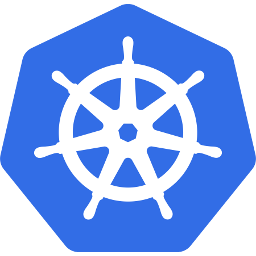
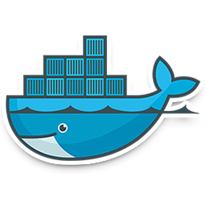

# 🌟 Projects

###   **AWS + Terraform Projects**
- [x] **[3-tier application deployment with github-actions CICD](https://github.com/danielFarag/aws-3-tier-cicd)**: Provision 3 tier application infrastructure with public/private subnets, security groups, NAT and SSM for configuration and Implement a simple CI/CD using Github actions.
- [x] **[Create EC2](https://github.com/DanielFarag/terraform-ec2)**: EC2 Instance with Custom Network Interface in AWS.
- [x] **[EC2 Slack Notifier](https://github.com/DanielFarag/ec2-slack-notifier)**: Monitor EC2 instance state changes using AWS Lambda & EventBridge, then send alerts to Slack via webhook.

###   **GCP + Terraform Projects**
- [x] **[gcp-secure-gke-network](https://github.com/danielfarag/gke-private-subnet-deployment)**:: Provision a highly secure GCP infrastructure featuring a private GKE cluster within a restricted subnet, an isolated management subnet with NAT, and public exposure via an HTTP Load Balancer, all configured with Terraform.

###  **Kubernetes Projects**
- [x]  **[Ingress-Like operator: Nginx Proxy](https://github.com/DanielFarag/k8s-ingress-controller)**: A custom controller that build a simple nginx proxy server.  

###  **Docker Projects**
- [x]  **[Dockerize a Laravel Project](https://github.com/DanielFarag/dockerize-laravel-demo)**: Containerize Laravel/Mysql/PhpMyadmin/Nginx/Vue application.  
- [x]  **[Dockerize a Node Project](https://github.com/DanielFarag/presentation-demo)**: Containerize a Node/Mysql/PhpMyadmin/Nginx/Angular application.  
- [x]  **[Dockerize a Jenkins](https://github.com/DanielFarag/dockerize-jenkins)**: Containerize a Jenkins pipeline ( `TOOD` allow to run as POD ).  

###  **Programming Projects**
- [x]  **[Bookstore (Node.js)](https://github.com/DanielFarag/bookstore)**: Develop a CRUD app consists of Books, Users, Reviews for managing library data using Express.js.
- [x]  **[DBMS (Bash)](https://github.com/DanielFarag/dbms-bash)**: Provides basic functionalities like creating, listing, and deleting databases, as well as managing tables.